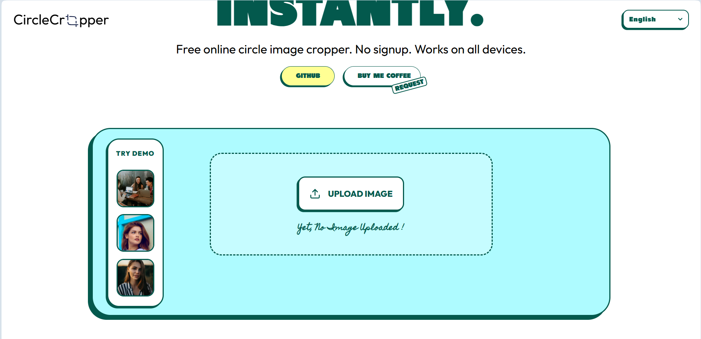

# <a href="https://circlecropper.netlify.app" target="_blank">CircleCropper — Crop & Download Circular Images</a>

CircleCropper is a tiny, privacy-first web tool for producing perfectly cropped circular images. Upload or pick a demo photo, position and zoom with a live preview, then export a high-quality circular PNG (transparent) or SVG mask. Everything runs in your browser — no uploads, no accounts, and no tracking. Fast, simple, and built for avatars, badges, and UI placeholders.

  
  
  
  

 

:star: Star me on GitHub — it helps!

# ✨ Features

 ✔️ Live Circular Preview (real-time)   ✔️ Client-side Cropping: keeps images private   ✔️ Drag & Position: move image under circular mask   ✔️ Zoom Controls: slider + pinch-to-zoom on touch   ✔️ Export PNG/SVG: transparent PNGs & SVG masks   ✔️ Export Presets: Original / 1080p / 4K sizes   ✔️ Keyboard & ARIA: accessible controls and shortcuts   ✔️ Demo Thumbnails: try sample images instantly   ✔️ Predictable Downloads: single-click Crop & Download   ✔️ Minimal & Fast: tiny bundle, no backend required 

## Installation

- [<b>GitHub</b>](https://github.com/byllzz/snippetkit) - Clone the repository to get the project files.
- [<b>VSCode / Any Code Editor</b>](https://code.visualstudio.com/) - To open and edit the code.
- [<b>Live Server</b>](https://marketplace.visualstudio.com/items?itemName=ritwickdey.LiveServer) - Optional, to view your changes live in the browser.
- [<b>Browser</b>](https://www.google.com/chrome/) - Open <code>index.html</code> to run the app.

# License 📄

This project is licensed under the MIT License - see the [LICENSE.md](./LICENSE) file for details.

Please contact me at bilalmalkdev@gmail.com if you have any feedback or suggestions. :star: Star it, if you like it!
